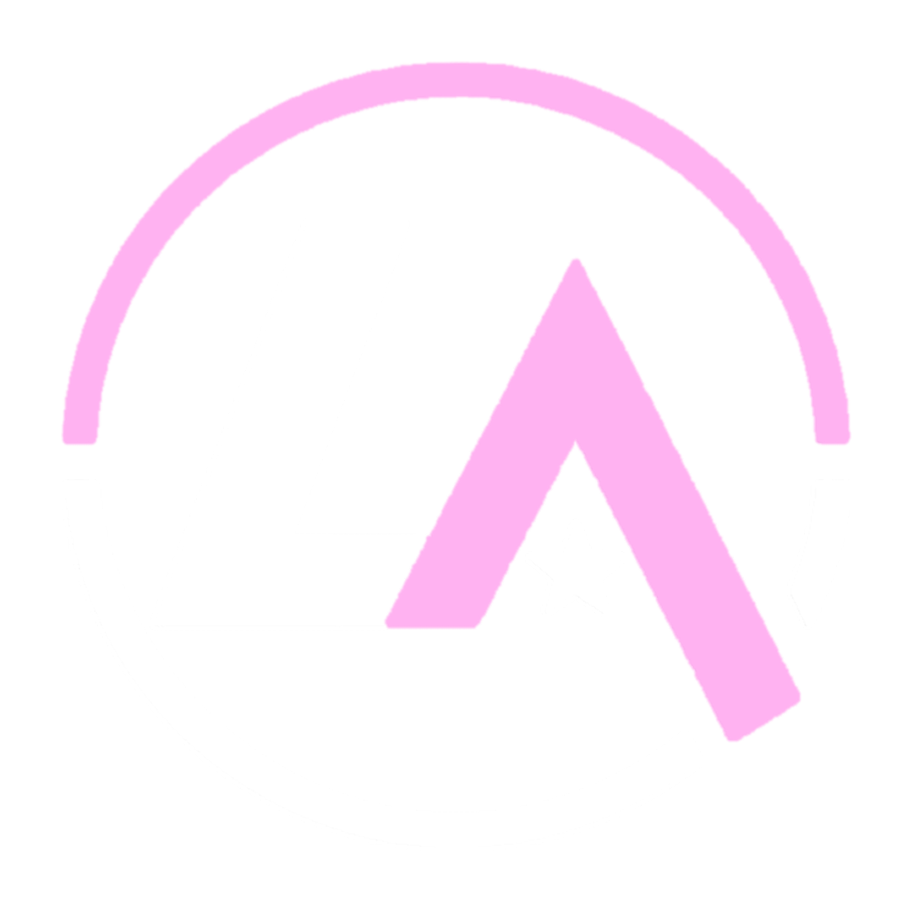

<div align="center">



# Legends Alley SDK

Build, check, and upload your community booth for Legends Alley, straight from Unity.

[](https://github.com/VRChat-Legends/LegendsAlleySDK/releases)
[](https://unity.com/releases/editor/whats-new/2022.3.22)
[](https://creators.vrchat.com/worlds/)
[](https://vrchatlegends.com/vpm)
[](https://discord.gg/6xPkZ7Dxp9)

[](https://vrchatlegends.com/vpm)

</div>

Legends Alley is a booth event by [VRChat Legends](https://vrchatlegends.com). Every approved community gets a plot in the event world and fills it with their own booth. This SDK is how you build that booth: it checks your work against the event limits as you go, then packages and uploads it without you ever leaving the editor.

## What you get

- **The SDK window**: sign in with Discord, see the current event and its deadline, check your booth against the live limits, and upload when everything is green.
- **A booth kit**: drop-in prefabs that already work in game, no scripting needed.
  - **Group Button**: a round button that opens your VRChat group page so visitors can join on the spot.
  - **Avatar Pedestal**: a compact clickable avatar picture that switches whoever presses it into your avatar.
  - **Video Player**: a booth-sized screen with play, pause, and volume controls. Plays YouTube links, direct video files, and live streams. It only runs for people standing near your booth, so fifty booths can each have one without melting anybody's frames.
  - **Slideshow**: drop in your images, press bake, and get a flipping picture board that costs your booth a single texture and a single material no matter how many slides you load.
  - **Portal**: paste a world ID and get a real VRChat portal to your community's home world.
  - **Pickup Reset**: a button that sends your pickups back to their start spots, optionally locked to specific usernames.
  - **Teleport Button**: hops the person pressing it between two spots in your booth.
  - **Animation Button**: fires a trigger or plays a state on your Animator, with a cooldown so it can't be spammed.
- **Separate budgets for the kit**: everything inside the bundled prefabs is counted on its own rows, so a video player or group button never eats into your booth's text, material, or udon limits.
- **A booth optimizer**: one click combines your meshes and atlases your textures down to a handful of materials, and it knows to leave the interactive stuff alone.
- **Live validation**: triangle counts, texture memory, draw calls, audio range, shader rules, all checked in the editor with plain-language hints instead of cryptic errors.

## Requirements

| | |
|---|---|
| Unity | 2022.3 (the VRChat Creator Companion installs the right version for you) |
| VRChat SDK | Worlds 3.7.0 or newer |
| Account | The Discord account that owns an approved Legends Alley community |

Don't have an approved community yet? [Apply here](https://vrchatlegends.com/alley/apply) first. Approval is per community, and the Discord account that applied becomes the one that can sign in and upload.

## Installing with the Creator Companion

1. Install the [VRChat Creator Companion](https://vcc.docs.vrchat.com/) if you don't have it yet.
2. Press the button below and let the Creator Companion take it from there:

   [](https://vrchatlegends.com/vpm)

   Prefer doing it by hand? In the Creator Companion open **Settings**, then **Packages**, then **Add Repository**, and paste:

   ```
   https://vrchatlegends.com/vpm/index.json
   ```

3. Open (or create) your **Worlds** project, click **Manage Project**, find **Legends Alley SDK** in the package list, and add it.
4. In Unity, open the window from the menu bar: **Legends Alley > SDK Window**.

That's it. Updates show up in the Creator Companion like any other VRChat package.

<details>
<summary>Installing without the Creator Companion (manual)</summary>

Grab the latest `com.legendsnexus.alley-sdk` zip from the [releases page](https://github.com/VRChat-Legends/LegendsAlleySDK/releases), unzip it into your project's `Packages` folder, and let Unity import. You'll need the VRChat Worlds SDK in the project already. The Creator Companion route is strongly recommended since it handles updates for you.

</details>

## Building your booth

1. **Sign in.** Open **Legends Alley > SDK Window** and press SIGN IN WITH DISCORD. Your browser handles the rest. Use the account that owns your community.
2. **Make the booth.** Create an empty object in your scene, add the **Legends Booth** component to it (Add Component, then Legends Alley, then Legends Booth), and build everything as children of that object.
3. **Mind the front.** The pink arrow gizmo shows which way your booth faces. Visitors approach from that side, so put your good stuff there.
4. **Check it.** The BOOTH tab shows every limit for the current event with your numbers next to them. Anything over the line comes with a hint about how to fix it, and clicking a row selects the objects responsible.
5. **Upload.** Press BUILD + UPLOAD. The SDK packages a copy of your booth (your scene is never touched), uploads it, and the server double checks everything. Uploading again later just replaces your previous version.

## The booth kit

Every prefab lives under **GameObject > Legends Alley** and each one has a friendly inspector that tells you exactly what it needs. Anything you leave inside a kit prefab is budgeted on its own checklist row instead of against your booth's generic limits, so use them freely.

### Group Button

Spawn it, paste your group ID into the inspector (it looks like `grp_12345678-1234-1234-1234-123456789abc`, copy it from your group page's address bar on the VRChat website), done. In game, pressing the button opens your group page so people can join right there.

### Avatar Pedestal

Paste your avatar ID (`avtr_...`, from the avatar's page on the VRChat website) and keep the avatar set to public. In game the avatar's picture appears right where the gizmo shows it, and pressing it switches people into your avatar. The picture is drawn by VRChat itself, so it won't show in the editor, only in game.

### Video Player

Paste a link and you're done. It handles:

- **YouTube videos**: paste the normal watch link
- **Direct video files**: any `https://` link ending in a video file, `.mp4` works best
- **Live streams**: stream links like VRCDN work out of the box

The player is range based. It starts on its own when someone walks within the play range you set (3 to 5 meters) and stops when they leave, so it never fights other booths for attention or bandwidth. Visitors get a play and pause button, a volume slider, a loading spinner, and a status readout. Audio is hard capped at 5 meters so your sound stays inside your booth.

When nothing is playing, the screen shows your **Screen image**: drop any texture into the inspector (there's a live preview) or leave it empty for the default Legends Alley plate.

### Slideshow

Drop your images into the list on the **Alley Slideshow Source** and press **BAKE SLIDES**. The bake packs every image into one texture atlas, so a whole deck of slides costs your booth a single texture and a single material. The board flips on its own (1 to 30 seconds per slide, your call), visitors get previous and next buttons, and a counter shows where they are in the deck.

Two things to know: the number of slides is capped per event (the inspector shows the current limit), and the board only knows about the last bake. Change the list and the inspector reminds you to bake again.

### Portal

Paste your world ID (`wrld_...`, from the world's page on the VRChat website) and keep the world public. In game a real VRChat portal stands where the gizmo shows, facing the same way as the object, and walking in takes people straight to your world. The checker blocks uploads with an empty or malformed world ID, a broken portal in the event world helps nobody.

### Pickup Reset

List the pickups it should send home (each needs a **VRC Object Sync** component) and you're done. Pressing it respawns them for everyone, which is the polite way to clean up after visitors scatter your props. Leave the allowed users list empty so anyone can press it, or add exact VRChat usernames to lock it to your crew, with an optional "denied" label for everyone else.

### Teleport Button

Point it at a destination marker, optionally add a return spot, and pressing it hops people back and forth. Teleports are local, only the person pressing moves. Both markers have to stay inside your booth bounds, the checker flags strays.

### Animation Button

Point it at your Animator, give it a trigger name (or a state name like `Base Layer.Open`), and pressing it plays your animation. Runs locally so one visitor can't yank the animation for everyone, and the cooldown keeps it from being spammed.

## Staying under the limits

- The BOOTH tab is the source of truth: it always shows the limits for the event you're uploading to.
- The TOOLS tab has the **booth optimizer**. Point it at your booth and it combines your meshes into one and packs your textures into shared atlases, usually the single biggest win for draw calls and material counts. It works on a copy and leaves your original disabled next to it, so you can always go back.
- Interactive things (the booth kit prefabs, pickups, anything with Udon on it) pass through the optimizer untouched, so it's safe to run on a finished booth.
- The kit prefabs don't eat your budgets. Their insides are excluded from the generic counts and show up on their own rows instead (video players, group buttons, pedestals, portals), each with its own event limit.
- The **Legends Booth** component has an **Isolate booth audio** toggle. Turn it on and the upload clamps every sound's range so your audio fades out at your booth's edge. Player voices are never affected.
- ProBuilder geometry is welcome. It gets combined and atlased automatically at upload time.
- Shaders are limited to an event whitelist: Standard, z3y, Filamented, lilToon, unlit, legacy, TMP, UI, and particle shaders. The checker names any material that's off the list. The VRChat Mobile shaders are deliberately blocked, they skip lightmaps and would leave your booth pitch black once the event world bakes its lighting. The one exception is VRChat Mobile Toon Standard, which lightmaps fine and is allowed.

## FAQ

<details>
<summary><b>Do I need to know how to script or use Udon?</b></summary>

No. The booth kit prefabs cover the interactive stuff and everything else is regular Unity building. If you do bring your own Udon, the event limits cap how much of it a booth can carry, and the checker will tell you where you stand.

</details>

<details>
<summary><b>Can my teammates upload the booth?</b></summary>

Only the Discord account that owns the approved community can sign in and upload. Anyone can help build the booth in Unity, but the final upload goes through the owner.

</details>

<details>
<summary><b>How do I update my booth after uploading?</b></summary>

Just upload again. Each upload replaces your previous booth for that event, and staff sync the newest version into the event world.

</details>

<details>
<summary><b>Which way does my booth face?</b></summary>

Toward the pink arrow on the Legends Booth gizmo (the local forward of your booth root). Plots in the event world are rotated so that arrow points at the walkway.

</details>

<details>
<summary><b>Why doesn't the video player play in the editor?</b></summary>

The video engine only runs in VRChat itself, so in the editor the screen stays dark. The controls, range behavior, and status text are all still wired up correctly, and it plays once you're in game. Also worth knowing: visitors who have "Allow Untrusted URLs" turned off in their VRChat settings won't get videos from most links, and the status text on the player tells them so.

</details>

<details>
<summary><b>Why does the video only start when I walk up to it?</b></summary>

On purpose. Videos load and play per visitor, only for people within your configured play range. That's what makes it safe for every booth in the hall to have a screen: nobody's client tries to stream fifty videos at once.

</details>

<details>
<summary><b>The avatar pedestal is invisible in the editor. Is it broken?</b></summary>

It's fine. VRChat draws the avatar picture in game, the editor can't render it. The purple gizmo box shows exactly where the picture will appear and how big it will be.

</details>

<details>
<summary><b>Why does my slideshow still show the old slides?</b></summary>

The board only knows what the last bake wrote into it. Change the image list, then press BAKE SLIDES again and the atlas, count, and counter all update together. The inspector warns you whenever the list and the bake disagree.

</details>

<details>
<summary><b>Walking into my portal does nothing.</b></summary>

Portals only work in uploaded worlds, they never fire in local Build and Test. If it still won't open in an uploaded world, double check the world ID and make sure the target world is public.

</details>

<details>
<summary><b>My booth is over the triangle or material limit. Now what?</b></summary>

Open the TOOLS tab and run the booth optimizer, it usually solves material and draw call problems in one go. For triangles, look at the checker's offender list (clicking the row selects the heaviest objects) and simplify those meshes. For texture memory, shrink textures that don't need to be 4K, most props read fine at 512 or 1024.

</details>

<details>
<summary><b>A shader I use got flagged. Why?</b></summary>

Booths from dozens of communities share one world, so shaders are limited to a whitelist the event world is known to handle well. Swap flagged materials to Standard or any listed family. If you think a shader deserves to be on the list, ask in the Discord.

</details>

<details>
<summary><b>Does uploading change my scene?</b></summary>

No. The SDK duplicates your booth, does all its preparation on the copy (lighting cleanup, audio caps, packaging), uploads, and deletes the copy. Your scene stays exactly as you built it.

</details>

<details>
<summary><b>Sign in opens the browser but never finishes.</b></summary>

Make sure you approve the Discord prompt with the right account, and that nothing is blocking `127.0.0.1` loopback connections (some aggressive firewalls do). Then try again from the SDK window. If it keeps failing, grab us in the Discord.

</details>

## For event staff

Signed in as staff? The SDK grows a few extras. The window gets a **booth manager**: it lists every uploaded booth for the selected event and syncs them onto the plots in the event world scene, with per-plot locking, single placements, and a randomize deal-out. Placements are stamped, so re-syncing only redownloads booths that actually changed.

Staff also get the event furniture under **GameObject > Legends Alley > Staff**: the **Booth Directory Board** (a searchable listing of every placed booth, rebuilt automatically after each sync, or by hand via **Tools > Legends Alley > Rebuild Booth Directories**) and the **Event Info Wall** (schedule and crew panels that read their text live from the event backend, so the world never needs a rebuild for a schedule change). Those menu items stay greyed out for everyone else, and the checker keeps them out of community booths.

## Need help?

Join the [VRChat Legends Discord](https://discord.gg/6xPkZ7Dxp9) and ask in the event channels. Bug reports and weird edge cases are welcome, screenshots of the SDK window's checker output help a lot.

